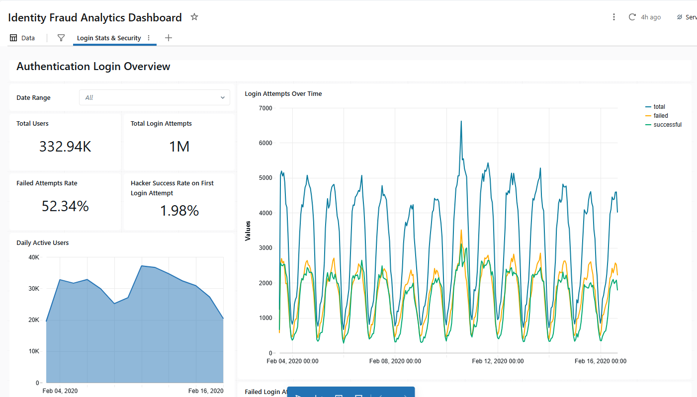

# Fraud Identity Login Analytics

In this project, we explored some of important features for fraud analytics, for instance, suspicious login attempts, high-frequency failed logins, multiple device logins, and frequent switches between geographic locations. These metrics serve as monitoring signals to detect potential fraudulent activity. Using information from a hacker IP dataset, we also analyzed known attack attempts and account takeover incidentsto have a bigger picture of the platform security and risk.

This study used a synthesized dataset containing approximately 1 million login attempts from over 330k users of a large-scale online service in Norway. 
The original data were collected between February 2020 and February 2021 as part of a research project on risk-based authentication. You can find more details about the study [here](https://github.com/das-group/rba-dataset). The dataset was created from real-world login behavior observed in a single sign-on (SSO) platform. To protect user privacy, all sensitive information was removed or anonymized, and does not allow re-identification of customers. The full coding analysis is available [here](https://github.com/chenny-l/id-fraud-risk-analytics/blob/main/notebooks/id_fraud_analytics.ipynb)

## Overview
The data set contains the following features related to each login
attempt on the SSO:

Feature                    | Data Type | Description                                                                                      | Range or Example
---------------------------|-----------|--------------------------------------------------------------------------------------------------|------------------------------------------------------
IP Address                 | String    | IP address belonging to the login attempt                                                        | 0.0.0.0 - 255.255.255.255
Country                    | String    | Country derived from the IP address                                                              | US
Region                     | String    | Region derived from the IP address                                                               | New York
City                       | String    | City derived from the IP address                                                                 | Rochester
ASN                        | Integer   | Autonomous system number derived from the IP address                                             | 0 - 600000
User Agent String          | String    | User agent string submitted by the client                                                        | Mozilla/5.0 (Windows NT 10.0; Win64; \...
OS Name and Version        | String    | Operating system name and version derived from the user agent string                             | Windows 10
Browser Name and Version   | String    | Browser name and version derived from the user agent string                                      | Chrome 70.0.3538
Device Type                | String    | Device type derived from the user agent string                                                   | (`mobile`, `desktop`, `tablet`, `bot`, `unknown`)[^1]
User ID                    | Integer   | Idenfication number related to the affected user account                                         | [Random pseudonym]
Login Timestamp            | Integer   | Timestamp related to the login attempt                                                           | [64 Bit timestamp]
Round-Trip Time (RTT) [ms] | Integer   | Server-side measured latency between client and server                                           | 1 - 8600000
Login Successful           | Boolean   | `True`: Login was successful, `False`: Login failed                                              | (`true`, `false`)
Is Attack IP               | Boolean   | IP address was found in known attacker data set                                                  | (`true`, `false`)
Is Account Takeover        | Boolean   | Login attempt was identified as account takeover by incident response team of the online service | (`true`, `false`)

** Note there are 1526 entries in user agents strings from the original dataset could not be parsed, so their device type is empty.

## Visuals

We will include a snippet of the visuals here. The full report is available in the [preview](https://github.com/lc587/id-fraud-risk-analytics/blob/main/dashboards/dashboard_preview.pdf). 

